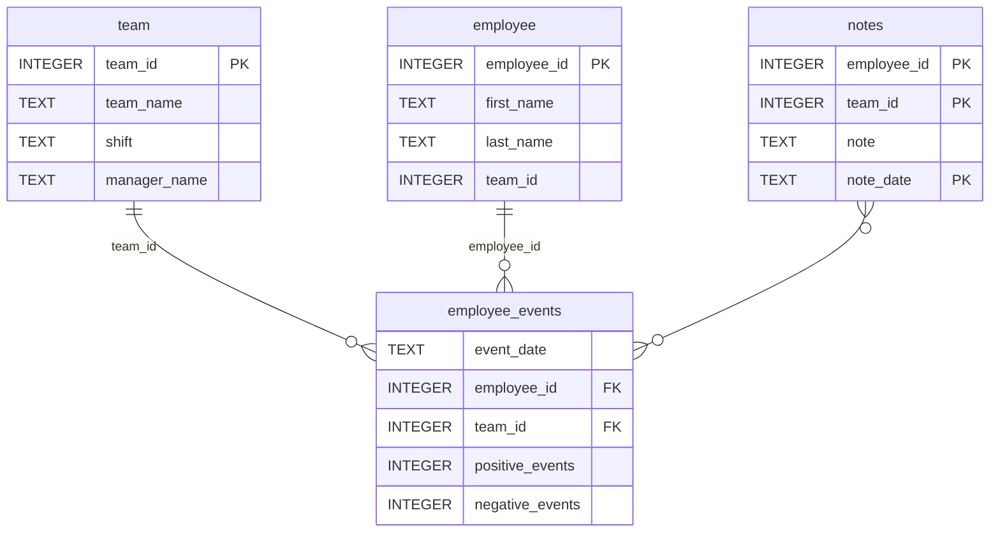

# Software Engineering for Data Scientists

This repository contains starter code for the **Software Engineering for Data Scientists** final project. Please reference your course materials for documentation on this repository's structure and important files. Happy coding!

### Repository Structure
```
├── README.md
├── assets
│   ├── model.pkl
│   └── report.css
├── env
├── python-package
│   ├── employee_events
│   │   ├── __init__.py
│   │   ├── employee.py
│   │   ├── employee_events.db
│   │   ├── query_base.py
│   │   ├── sql_execution.py
│   │   └── team.py
│   ├── requirements.txt
│   ├── setup.py
├── report
│   ├── base_components
│   │   ├── __init__.py
│   │   ├── base_component.py
│   │   ├── data_table.py
│   │   ├── dropdown.py
│   │   ├── matplotlib_viz.py
│   │   └── radio.py
│   ├── combined_components
│   │   ├── __init__.py
│   │   ├── combined_component.py
│   │   └── form_group.py
│   ├── dashboard.py
│   └── utils.py
├── requirements.txt
├── start
├── tests
    └── test_employee_events.py
```

### employee_events.db



# Employee and Team Performance Dashboard

## Overview

The **Employee and Team Performance Dashboard** is a FastHTML-powered web application that visualizes performance metrics for employees and teams in an organization. The dashboard provides interactive charts, a recruitment risk analysis, and notes related to employees and teams.

The project utilizes:

- **Python** for back-end processing
- **SQLite** for database management
- **FastHTML** for building interactive and responsive dashboards
- **Matplotlib** for data visualization
- A **machine learning model** for predicting recruitment risks

## Features

- **Interactive Dropdowns** to select employees or teams
- **Cumulative Line Chart** for positive and negative event counts
- **Bar Chart** predicting recruitment risks with color-coded risk levels (Green, Yellow, Red)
- **Notes Table** displaying event logs and comments for employees or teams
- **Dynamic Filtering**: Switch between "Employee" and "Team" modes
- **Default View**: Dropdown filters without charts until a selection is made

## Directory Structure

```
project_root/
├── README.md
├── assets/
│   ├── model.pkl            # Machine Learning Model for Recruitment Risk Prediction
│   └── report.css           # CSS for styling the dashboard
├── python-package/
│   ├── employee_events/
│   │   ├── __init__.py      # Package Initialization
│   │   ├── employee.py      # Employee-specific SQL queries
│   │   ├── query_base.py    # Base query class
│   │   ├── sql_execution.py # SQL Mixin for query execution
│   │   └── team.py          # Team-specific SQL queries
│   ├── setup.py             # Python package setup file
├── report/
│   ├── base_components/     # Base dashboard components (charts, tables, etc.)
│   ├── combined_components/ # Combined components for layout
│   ├── dashboard.py         # Main dashboard logic
│   └── utils.py             # Utility functions (e.g., loading the model)
├── tests/
│   └── test_employee_events.py # Pytest tests for database and tables
├── requirements.txt         # List of dependencies
└── start                    # Start script for launching the app
```

## Setup Instructions

### 1. Prerequisites

Ensure you have the following installed:

- Python 3.8 or higher
- SQLite3
- Git

### 2. Installation Steps

1. **Clone the Repository**:

   ```bash
   git clone <repo-url>
   cd dsnd-dashboard-project
   ```

2. **Set Up a Virtual Environment**:

   ```bash
   python -m venv env
   source env/bin/activate  # On Windows: env\Scripts\activate
   ```

3. **Install Dependencies**:

   ```bash
   pip install -r requirements.txt
   ```

4. **Build and Install the Python Package**:

   ```bash
   cd python-package
   python setup.py sdist
   pip install dist/employee_events-0.1.tar.gz
   ```

5. **Start the Dashboard**:

   ```bash
   python report/dashboard.py
   ```

6. **Access the Dashboard**:
   Open your browser and navigate to:
   ```
   http://127.0.0.1:8000/
   ```

## Usage Instructions

1. **Default View**: The dashboard will display dropdown filters to select an employee or team.
2. **Employee Mode**:
   - Select "Employee" and choose an employee from the dropdown.
   - View:
     - Cumulative line chart for positive and negative events.
     - Bar chart predicting recruitment risk.
     - Notes table listing event logs.
3. **Team Mode**:
   - Select "Team" and choose a team from the dropdown.
   - View:
     - Cumulative line chart for team-level events.
     - Bar chart predicting recruitment risk.
     - Notes table listing team event logs.

## Key Components

### 1. Python Package

- `QueryMixin`: Handles opening/closing SQLite connections and executing queries.
- `QueryBase`: Base class for common SQL operations.
- `Employee` and `Team`: Subclasses that implement specific queries.

### 2. Visualization

- **LineChart**: Displays cumulative counts for positive and negative events.
- **BarChart**: Predicts recruitment risk using a pre-trained machine learning model with color-coded outputs.
- **NotesTable**: Displays notes and event logs.

### 3. FastHTML Routes

| Endpoint            | Description                        |
|---------------------|------------------------------------|
| `/`                 | Default view (filters only)        |
| `/employee/{id}`    | Employee dashboard                 |
| `/team/{id}`        | Team dashboard                     |
| `/update_dropdown`  | Updates the dropdown dynamically   |
| `/update_data`      | Submits the selected filter values |

## Testing

Run tests using **pytest**:

```bash
pytest tests/test_employee_events.py
```

### Tests Include

- Verifying database file existence
- Checking table presence (employee, team, employee_events)

## Suggestions to Stand Out

- **Color Scale**: The bar chart applies a color scale (green, yellow, red) based on predicted recruitment risk.
- **Dynamic Title**: Dashboard title updates based on filter settings ("Employee Performance" or "Team Performance").

## Screenshots

### Employee View


### Team View


## Contributing

If you wish to contribute:

1. Fork this repository
2. Create a new branch
3. Commit your changes
4. Submit a pull request

## License

This project is licensed under the MIT License. See the LICENSE file for details.

---
**Developed with Python and FastHTML** 🚀
